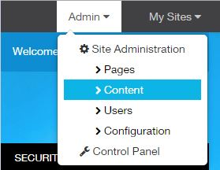
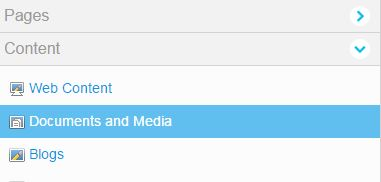
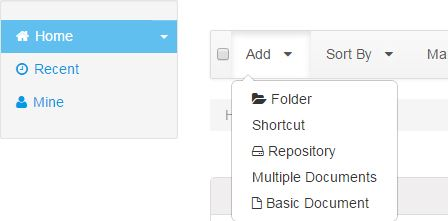
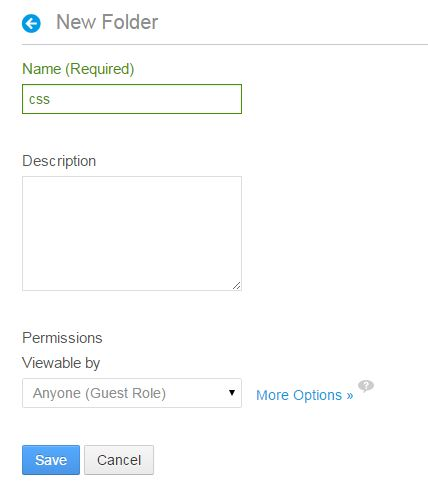
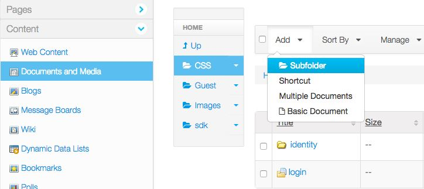
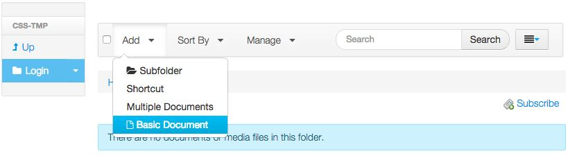
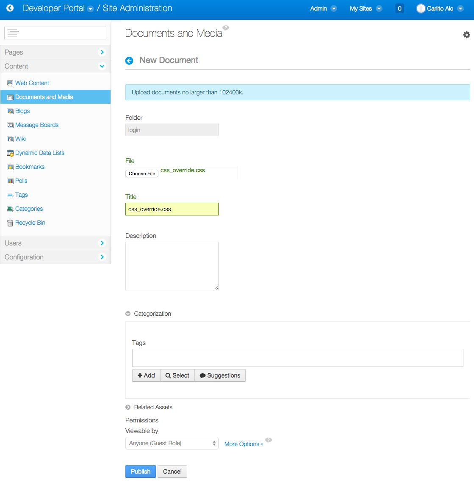
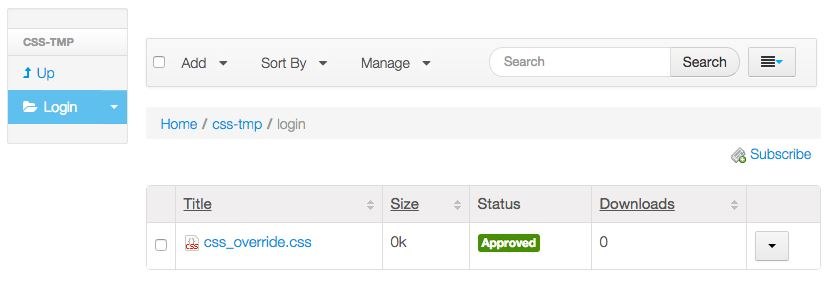

# Custom Style Sheet
These are the steps necessary for uploading a custom style sheet to override the CSS on the Login UI.

1. Log into the portal instance as a Portal Administrator.
2. Click **Admin** and select **Content**.

3. From the sidebar menu, choose **Documents and Media.

4. Click **Add** and choose **Folder**.

5. Enter **css** for the new folder name and click the **Save** button.

6. Enter the **css** folder by clicking on the folder name
7. Add a Subfolder, enter **login** for name and click **Save**.

8. Enter the **login** folder by clicking on the folder name.
9. Add a **Basic Document**.

10. Click **Choose File** to upload your style sheet named **css_override.css**. Enter “css_override.css” for
the Title and click **Publish**.

11. This style sheet will override the default css used on the login screens.

