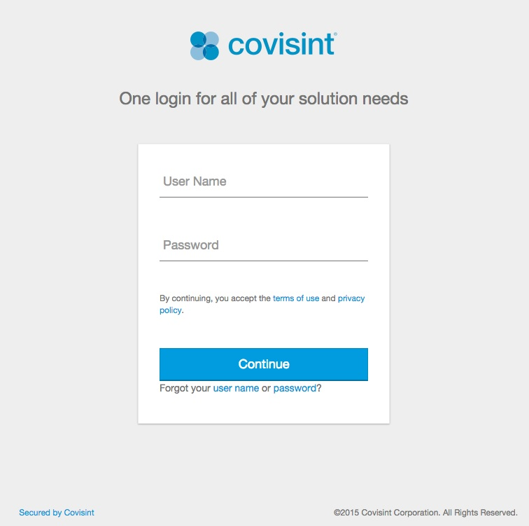
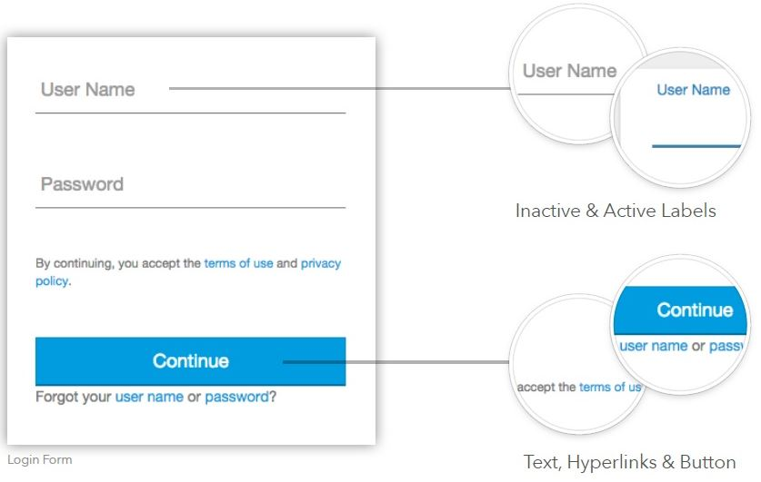
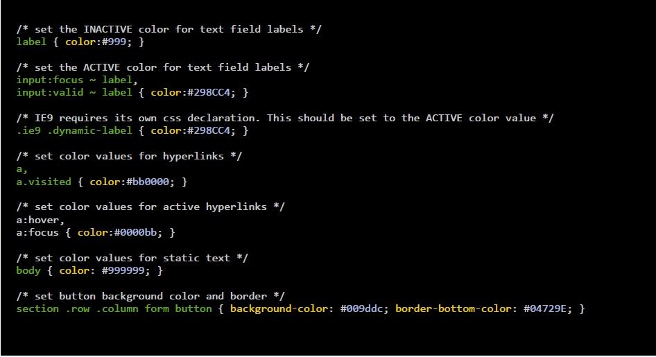

# ID Authenticator Branding
CIS UI is split into three basic sections. A header at the top, the login form
in the middle, and a footer at the bottom.

All customizations are accomplished by adding CSS to css_override.css.

## Header

* The header consists of an logo/image and tagline.
* To change the logo, add the following to css_override.css with the correct path to your logo in the Portal CMS. The file can be png, jpg, or gif. Also be sure to specify the width and height of your image.

css_override.css

The tagline is a label.

## Login Form
Several elements in the login form can be customized. These include text color for both active and inactive labels, hyperlinks, button text and background color.

css_override.css

## Footer
Static text and hyperlinks in the footer will inherit styles set for the login form. If needed, these can by styled independently.

css_override.css

