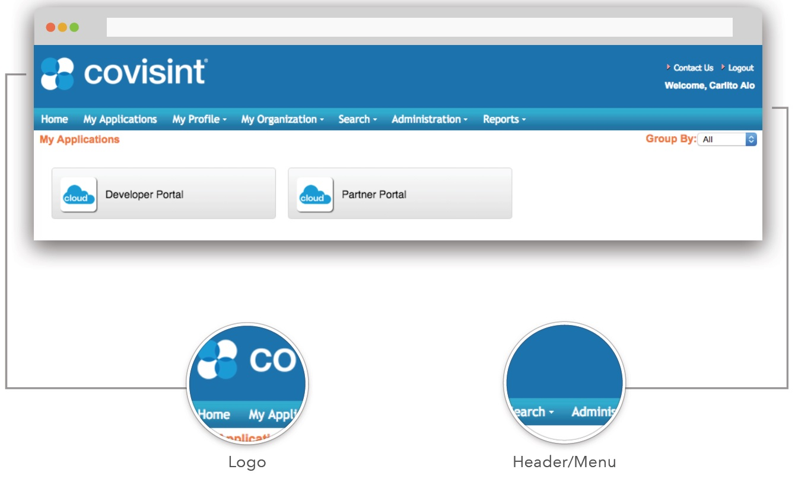
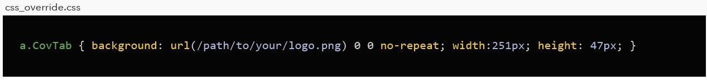
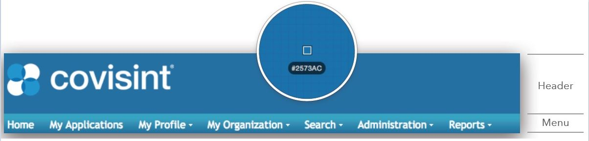
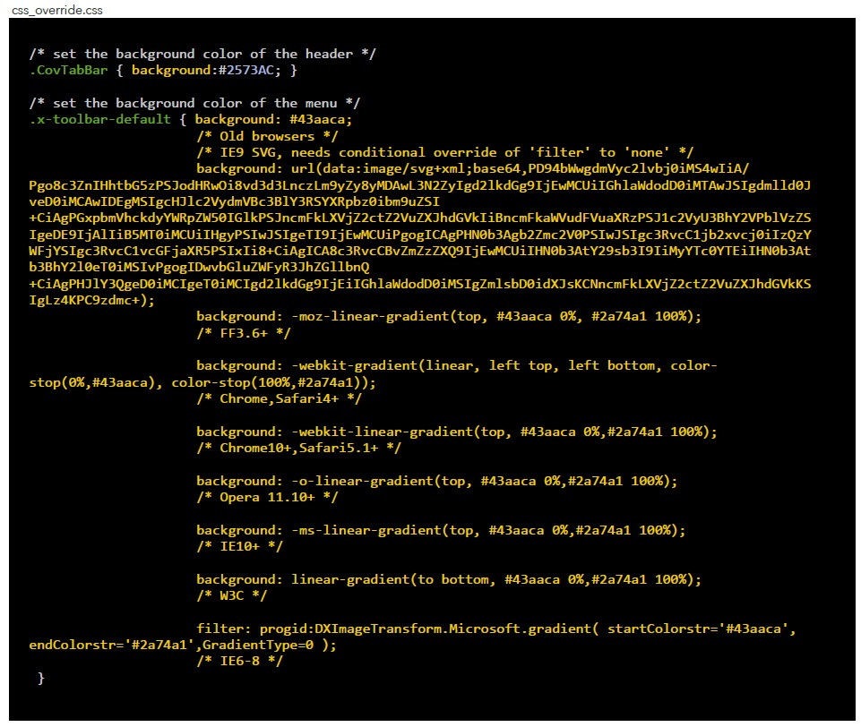

# ID Provisioner Branding

CIS Cloud ID-Provisioner consists of **header** at the top which contains the
**logo**, and the **menu** just below the header.

All customizations are accomplished by adding CSS to **css_override.css**.

## Logo
To change the logo, add the following to css_override.css with the correct path to your logo in the Portal CMS. The file can be png, jpg, or gif. Also be sure to specify the width and height of your image.

## Header/Menu
The header and menu may be styled with solid colors, gradients, or graphics. To minimize page load, use hex values for colors & gradients and only use graphics if absolutely necessary.

