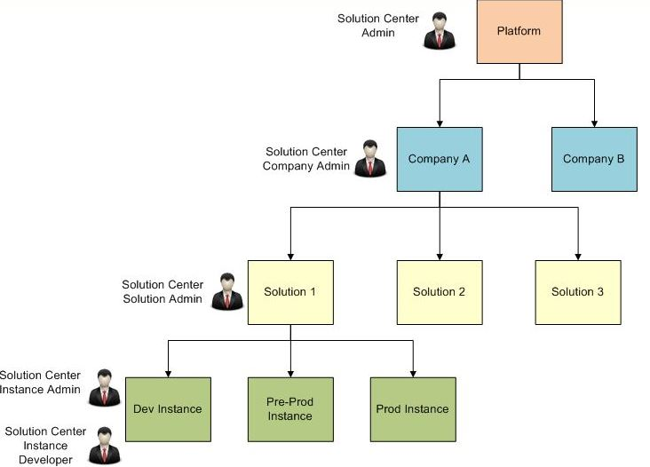

## Covisint Developer Solution Center Roles

The Developer Portal Solution Center has its own set of associated roles, and when a user is granted a role, they gain access to specific features for that application.

### Solution Center Admin Role
Solution Center Admin are the highest level administrators in the Solution Center. They can manage the entire platform, and for most installations, this role will be limited to Covisint personnel. Solution Center Administrators can access the features of all subsequent roles. The first Solution Center Administrator will need to be added manually to the system.

### Solution Center Company Admin Role
Solution Center Company Admin represent the top-level administrators at a partner or customer that will be using the Solution Center.  They are primarily focused on creating solutions, and inviting other users to join the company.  This role is automatically tied to the company associated with the user.  Company Administrators can access features of all subsequent roles, but only on solutions and instances that are owned by their company.

### Solution Center Solution Admin Role
Solution Center Solution Admin are those individuals within a company that have been given ownership over a solution.  They are primarily focused on tasks such as managing instances and releases for a solution.  This role must be granted to a user for each solution on which they need ownership.  Solution Administrators can access features of all subsequent roles, but only on solutions they own. They have complete read access to everything in their company, but no ability to change solutions for which they don't have ownerships.

### Solution Center Instance Admin Role
Solution Center Instance Admin are those individuals within a company that have been given ownership over a solution instance.  They are primarily focused on tasks such as assigning developers and deploying releases to an instance.  This role must be granted to a user for each instance on which the need ownership.  Instance Administrators can access features of all subsequent roles, but only on instances they own.

### Solution Center Instance Developer Role
Solution Center Instance Developers are those individuals within a company that have been given development rights on a solution instance.  They are primarily focused on tasks such as deploying to development instances and restarting portal runtime nodes.  This role must be granted to a user for each instance on which they need access.

### Solution Center User Role
A Solution Center User is the most basic role in the Solution Center.  It should automatically be applied to any user that has been granted the service package for the Solution Center.  Those with the Solution Center User role have complete read access to everything in their company, but no ability to change anything.

### Role Map
This section illustrates the concept of the solution center roles using an example. Some roles implicitly have access to the features of lower-level roles beneath them. The Solution Center Administrator has access to every solution and instance on the platform, even if they have not explicitly been granted the Solution Administrator or Instance Administrator roles. In the role map below, there are two companies on the platform - Company A and Company B. The Solution Center Admin role has access to all the features in Company A and Company B. Some roles must be granted against the entity which they are intended to protect. The Solution Center Company Admin has access to all the features within Company A. In other words, the Solution Center Company Admin has access to all the solutions under Company A - Solution 1, Solution 2, and Solution 3. The Solution Center Solution Admin role has administrative rights to just one particular solution and all the instances under that solution. This role has access to Solution 1, and all the instances - Dev Instance, Pre-Prod Instance, and Prod Instance. The Solution Center Instance Admin and the Solution Center Instance Developer roles have administrative rights to only the instance they're given access to. They have access to Dev Instance.

Figure 2. Solution Center Role Map

