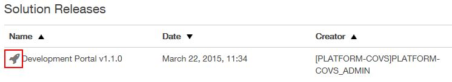

## Deploy Release
This section depicts how to deploy the release components into an instance.

### What is a Runtime Node?

A runtime node is a running copy of an application.  At this time, they are limited to the Covisint portal, which means that each runtime node is a running portal.  For development instances, there is only one runtime node per instance.  For pre-production and production instances though, there will be multiple runtime nodes to provide load balancing and fault tolerance for the instance.  Each runtime node within an instance will always run the exact same copy of the application.

### Who can perform this function?
Any of the roles below:
* Solution Center Administrator
* Solution Center Company Administrator
* Solution Center Solution Administrator
* Solution Center Instance Administrator

### Deploy a specified portal release to an instance and configure portal runtime nodes for an instance
#### Steps:
1. Click the **Solutions** tab.
2. On the left panel of the **Solution Center**, click **Solutions**. A list of all the solutions for your company that have access to the solution center will be displayed.
2. Select your solution by clicking on the solution name.
3. Click the **Instances** tab. A list of all the instances for the selected solution will be displayed.
4. Select an instance by clicking on the instance name to retrieve an instance.
5. Click the **Deploy** tab.
6. Click **Deploy a different Release**. A list of active solution releases will be displayed.
7. Click on the rocket icon next to the desired instance name.

8. Release will be deployed, and will be available once the nodes have started.
    * The number of portal runtime nodes for a development instance is 1.
    * The number of portal runtime nodes for a pre-production instance is 2.
    * By default, the number of portal runtime nodes for a production instance is 2. However, you're allowed to increase the number of portal runtime nodes for a production instance upto 10.
12. You can view the status of all the portal runtime nodes under the **Active Nodes** section.
13. You can scale up your nodes for an instance by clicking on the up arrow next to the **Scale** field under the **Scales Nodes** column. Also, you can increase the node memory by clicking on the up arrow next to the **Scale** field under the **Memory per Node** column. The maximum amount of memory allowed per node is 4GB.
