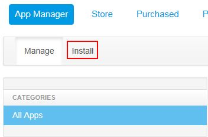

## Hot Deploy a portal WAR
Hot Deploy a portal WAR file to an instance

### Who can perform this function?
* Solution Center Administrator
* Solution Center Company Administrator
* Solution Center Solution Administrator
* Solution Center Instance Administrator
* Solution Center Instance Developer

### Steps:
1. Log into your portal instance.
2. Click **Admin** and then **Control Panel**.		

3. Click the **Apps** tab, and then click the **Install** tab.		

4. Select either **File Upload**, and then choose a LPKG or WAR file, or URL to install a layout template.		    

5. Click **Install**.
