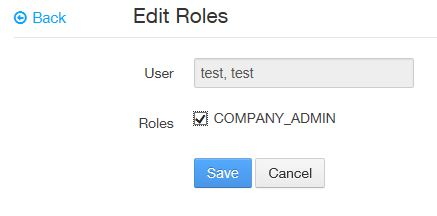
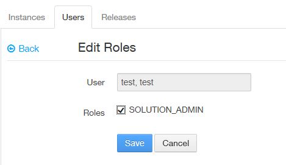

## Assigning Roles

### Assign the Solution Center Company Admin role to a user account for a company
#### Who can perform this function?
Any of the roles below:
* Solution Center Admin
* Solution Center Company Admin

#### Note: The first user of an organization to go to the Solution Center gets the Solution Center Company Admin role.

#### Steps:
1. Click the **Solutions** tab.
2. On the left panel of the **Solution Center**, click **User Management**.
3. A list of user accounts for your company will be displayed.
4. Select a user by clicking on the edit icon next to the desired user name.
5. Check the box next to **COMPANY ADMIN**, and click the **Save** button to assign the company admin role to the user.

### Assign the Solution Center Solution Admin role to a user account for a solution
#### Who can perform this function?
Any of the roles below:
* Solution Center Admin
* Solution Center Company Admin
* Solution Center Solution Admin

#### Steps:
1. Click the **Solutions** tab.
2. On the left panel of the **Solution Center**, click **Solutions**. A list of all the solutions that have access to the solution center will be displayed.
3. Select your solution by clicking on the solution name.
4. Click the **Users** tab. A list of users who have access to your solution will be displayed.
5. Select a user by clicking on the edit icon next to the desired user name.
6. Check the box next to **SOLUTION ADMIN**, and click the **Save** button to assign the solution admin role to the user.

### Assign the Solution Center Instance Admin role to a user account for an instance
#### Who can perform this function?
Any of the roles below:
* Solution Center Admin
* Solution Center Company Admin
* Solution Center Solution Admin
* Solution Center Instance Admin

#### Steps:
1. Click the **Solutions** tab.
2. On the left panel of the **Solution Center**, click **Solutions**. A list of all the solutions for your company that have access to the solution center will be displayed.
3. Select your solution by clicking on the solution name. A list of all the instances for the selected solution will be displayed.
4. Select an instance by clicking on the instance name to retrieve an instance.
5. Click the **Users** tab. A list of all the users for your instance will be displayed.
6. Select a user by clicking on the edit icon next to the desired user name.
7. Check the box next to **INSTANCE ADMIN**, and click the **Save** button to assign the solution admin role to the user.

