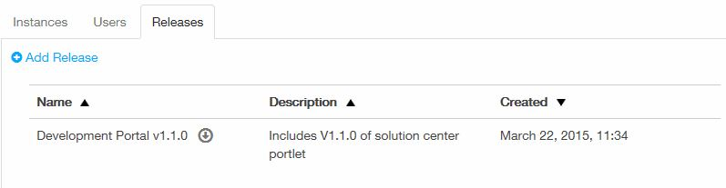
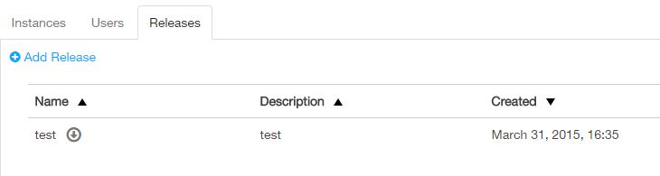

## Managing Releases
### What is a Release?

Releases are bundles of artifacts that are to be deployed to an instance together.  To prevent issues with knowing what is actually deployed, once a release is created, it is immutable.  A release can be used across any number of instances.

### Who can perform this function?
Any of the roles below:
* Solution Center Administrator
* Solution Center Company Administrator
* Solution Center Solution Administrator
* Solution Center Instance Administrator

### Create the release definition

The release definition can be configured using a yaml file that defines:
* the location of your maven repository
* the repository Id
* authentication to the repository (this is optional)
* list of deployment artifacts using GAV notation

See the example below:

```
repository:
  location: nexus.covisintrnd.com:8081/nexus
  repo-id: covs-release
  skip-ssl: true #optional default - false
  authentication:
    username: admin
    password: welcome
webapps: #specify all wars as a sequence of GAV Coordinates this would go into tomcat\webapps folder
  - g: com.yourGroup
    a: your-Artifact
    v: your-Version

  - g: com.yourGroup
    a: your-nextArtifact
    v: your-nextVersion
```


### Create a release
#### Steps:
1. Click the **Solutions** tab.
2. On the left panel of the **Solution Center**, click **Solutions**. A list of all the solutions that have access to the solution center will be displayed.
2. Select your solution by clicking on the solution name.
3. Click the **Releases** tab. The history of releases will be displayed if you have any previous releases.
4. Click **Add Release** to create a new release.

5. Provide a friendly name for the release in the field **Name**.
6. Enter the release description in the field **Description**.
7. Attach a YAML file.
8. Click the **Add** button to add the release to your solution.



### Retrieve the manifest file for a release
#### Steps:
1. Click the **Solutions** tab.
2. On the left panel of the **Solution Center**, click **Solutions**. A list of all the solutions that have access to the solution center will be displayed.
2. Select your solution by clicking on the solution name.
3. Click the **Releases** tab. The history of releases will be displayed if you have any previous releases.
4. Click on the down arrow next to the desired release name to download the **manifest.yaml** file.

