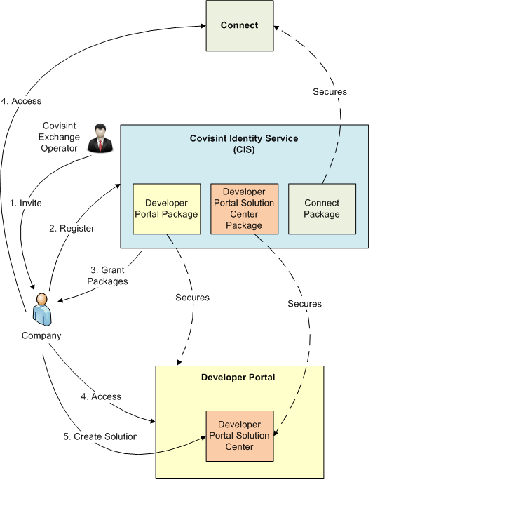

# Understanding Covisint Platform
This section denotes the users and entities that are part of the Covisint Platform solution.

The term platform refers to the Covisint Cloud Platform that companies can use to develop and run custom applications based on Covisint APIs.  There are many components that make up the Covisint Cloud Platform, but at a high-level, they can be broken down into the following categories:

Platform Applications and APIs (e.g. Connect, CIS and Identity APIs)
Platform Application Services (e.g. API Gateway, databases and consolidated logging) 
Platform Administration (e.g. Developer Portal)
Customer Applications (primarily portal applications at this time)

The following diagram illustrates how different components of the Covisint Platform are tied together.

**Covisint Identity Service** is responsible for the following functions:
    * Company registration
    * User registration
    * Registration Approval
    * Controls access to the applications - Developer Portal, Developer Portal Solution Center, and Connect. This is done via the service packages.
        - Developer Portal Package controls access to our Developer Portal.
        - Developer Portal Solution Center controls access to the Developer Portal Solution Center. 
        - Connect Package controls access to our Connect application.
        
Typically, the workflow is as follows:
1. Covisint Exchange Operator will send an invite to a company that would like to access the Platform.
2. Upon receiving the invitation, the company will register with our Covisint Identity Service which manages all of the user accounts and their access. The registration request submitted by the Customer will then be reviewed and approved by the Covisint Exchange Operator.
3. Covisint Exchange Operator will grant desired packages to the company.
4. Upon receiving the grants for the Developer Portal Package and/or Connect package, the company will be able to access the Developer Portal application and/or Connect.
5. To access the solution center area within the Developer Portal, the company user needs to have grants to the Developer Portal Solution Center package.

